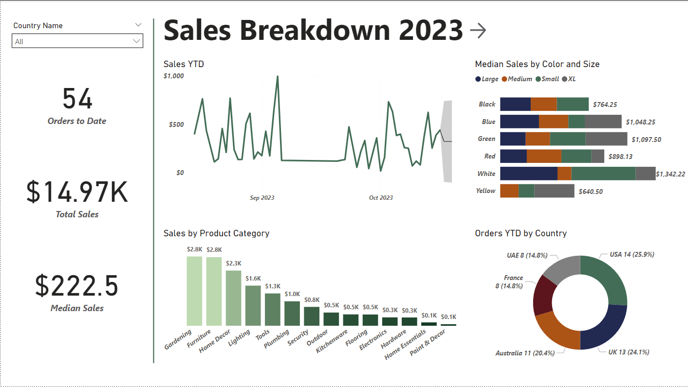

# Power BI Sales Project Display

Overview

This project simulates the process, from start to finish, of creating reports within Power BI using company sales data. While the data is clearly not reflective of a real-world business, the work is a display of my experience, knowledge, and expertise when it comes to utilizing Power BI to create visuals and reports in order to generate insights. 

Collecting, Importing, & Loading the Data

For this project I made use of three Excel files: a Countries file, a Purchase file, and a Sales file. The last of which required cleaning in Excel using functions and formulas as well the creation of three new columns being Gross Revenue, Total Tax, and Net Revenue. Before moving forward I made sure to make copies of the original data files as backups. From there, I imported the data into Power BI and opened Power Query. I made further changes to certain Column names, altered column data types as necessary, and reviewed Column Quality, Distribution, & Profiles to ensure that there were no issues with the entries or the values that they held. 
In closing Power Query, I went to the Model View, removed the assumed relationships and proceeded to get data containing Currency Exchange information (as the sales were collected from five different countries) using a Python Script. To simplify the model’s use of time based analysis, I further added a Calendar Table using DAX code. 

Completing the Model 

With all of the tables imported to the file, I created a “Sales in USD” table with DAX using the “Sales” and “Currency Exchange” tables, adjusting Gross Revenue, Total Tax, and Net Revenue for the exchange rate attached to each sale. I then created a few calculated measures from this new table. These included ‘Median Sales’, ‘YTD Orders’, and ‘Quarterly Orders’. Finally, I arranged the tables in the model view and built the relationships for each in the Manage Relationships window, ensuring the correct cardinality and cross-filter direction.

Sales Overview Page 

Moving to the report view, I started creating the first page, renaming it “Sales Overview”. I spent a fair bit of time exploring various ways to visualize the data in a way that was informative yet general in scope, with the capacity to be filtered further. For this page I ended with four charts and three card visuals. Again, to reiterate the data used is not reflective of a real company so it was a bit limited in certain areas. However, I focused on creating easily digestible and intuitive visuals that optimized the “ink to information” ratio within a very instinctive report layout. 
When it came to formatting each visual I removed redundancies to eliminate clutter. For instance in the sales by product category chart I removed the left axis labels and title due to the addition of data labels. With the donut chart depicting orders by country, the legend was omitted as the callouts included all the information needed. In addition to this, I added a forecast of three days at a 95% confidence interval to the sales over time line chart and sorted the sales by product category bar chart in descending order with a conditional formatting gradient. To finish off the report page, I added ‘Total Orders’ to date, ‘Total Sales’, and ‘Median Sales’ cards for quick insights as well as a title and slicer that filters by Country. 

Order Data Page 

The approach to this page was similar. I spent some time trying other visual types with the order data for variety and really tried to refine the overall design. When it came to the number of items purchased by country flow chart, I had to ensure that the X-axis was sorted by month and not volume, and that the legend title was removed. The order count by customer bar chart was sorted in descending order and filtered using TopN to limit the results. Beyond the charts, a gauge was added to this page displaying orders this quarter against a set target value as well as two cards being the number of items sold and the current stock on hand. Furthermore, a Country slicer was added and synced with the one on the Sales Overview page. 

Additional Steps 

In rounding out the entire file, I added navigation buttons between the pages. I also spent considerable time making the theme consistent, saving that theme to a JSON file, and spacing the elements evenly, creating a polished and repeatable look/feel. I then ran the Performance Analyzer on both pages to check load times and note the durations. As expected with this limited data, nothing was out of the ordinary or of concern. At this point I wanted to implement drill through on at least one visual. Thus, I created a hierarchy starting with the Country Name Field, then ZIP Code, followed by Address. I placed this into the orders by country donut chart, enabling the user to filter down into the more granular data. Lastly I created a Bookmark that was set on France with the donut chart drilled down to the ZIP Code level. 

Potential Next steps 

- Design the Mobile layout  
- Share to Power BI Service  
  - Create artificial Workspace 
  - Create a Dashboard 
  - Set permissions
- Add accessiblity features (controls & Alt text)
- Make and add additional entries for a more complete model

